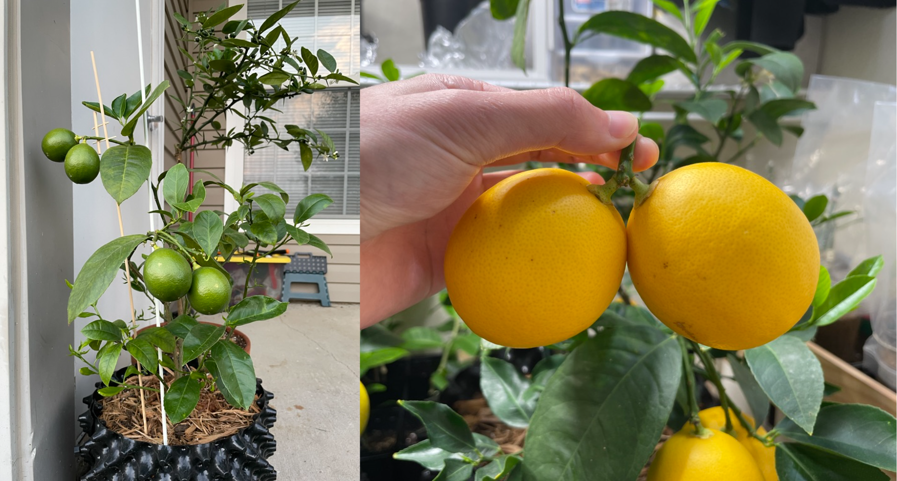

  ECE 312 Intro

  Spring 2026, UT Austin

  Instructor: Neil Zhao, Assistant Professor

---

# Basic Course Information

<v-clicks depth="1">

- **When and Where**: Mon & Wed, 1:30 pm–3:00 pm, EER 1.516
- **Instructor**: Neil Zhao; neil.zhao@utexas.edu
  - "Rule #0" of this course: Call this guy "Neil"
  - Office Hours (EER 5.890):
    - Mon: 3:00 pm–3:30 pm
    - Tue: 2:30 pm–3:00 pm
    - Or by appointment through email
- **Recitation**: Wed 10:00 am–11:00 am (17925) or 12:00 pm–1:00 pm (17935), EER 0.818
- **TA**: Allison Seigler
  - Office Hour: TBA

</v-clicks>

---

# About the Instructor

<v-clicks depth="1">

- Neil Zhao, Assistant Professor, joined our department this past Fall. I spent a year at NVIDIA before joining
- Research interests:
  - Computer architecture and systems (especially clouds/datacenter)
  - Security and privacy
- Topics I worked on and am working on:
  - Side-channel attacks in public clouds
  - High-performance defenses to side-channel attacks
  - Trusted-execution environments
  - Secure datacenter management
- I also teach "ECE 382N: Security at the Hardware-Software Interface" during Fall semesters
  - Research-oriented graduate-level course. But undergrads are also welcomed!
- **Also a citrus tree grower!**

</v-clicks>

---

---

# Course Overview

<strong>One-line objective</strong>: Learn how to think like a programmer and write beautiful software

**In this course, you will**
- Learn time-tested programming languages like C and C++
- Learn various algorithms and data structures to write efficient and well-organized programs
- Learn skills to comprehend, participate in, and manage moderately sized software projects

**This course will prepare you for**
- Developing complex real-world software and hardware systems
- Improving your technical skills to live a more productive life
- Adopting a new programming/algorithmic thinking mode

My programming story (or how I got into the graduate school)

---

# Wait! What about "AI" and "AI Coders"?

<v-clicks depth="1">

- (Sadly) Most assignments in this course can be automatically solved by "AI" :(
- This is because these assignments are introductory programming problems
  - Tons of textbook/online materials are available for "AI" to learn (and infringe their copyright)
  - The same goes for popular languages (e.g., JavaScript) and frameworks (e.g., Electron)
- Anecdotally, these AI tools are far from perfect on "less-popular" languages and complex frameworks
  - E.g., hardware/system simulators, complex open-source software like LLVM and Linux
  - **You need to build up your muscles in this course to effectively and responsibly use these AI tools**
- I was horrified by some of the code suggestions that AI made in our research projects
- **What about using AI for code autocompletion?**
  - Not recommended. It's more mentally taxing to exam the code's correctness than writing it myself
  - It's the difference between driving and coaching someone to drive!

</v-clicks>

---

# What is "AI" Good at?

<v-clicks depth="1">

- **Semantic search.** IMO, LLM + "Search Mode" is the next generation search engine
  - You can describe complex things you wish to search. No longer keyword based
  - Multimodal, you can upload screenshots for tasks that are inherently visual (e.g., web development)
  - Good for finding niche documentation and features
- **Boilerplates.** Read and write boilerplate emails/documentation/code skeletons
- **An extra pair of eyes.** Check for common programming/writing errors
  - These tools are good at finding *common* errors that slip our mind (e.g., forget to free a piece of memory)
  - Can have false positives, don't over-trust it

</v-clicks>

Summary: Use them for natural language processing and common, repetitive tasks

Caution: Be aware of fabrication! Always ask it to cite sources and check them for correctness

---

# Our Policy for Using "AI"

**General policy**: Acceptable to use AI to retrieve and process information, but not to create original content

 

**Allowed**
- Clarify a confusing concept (but be aware of hallucinations/fabrication)
- Find and summarize relevant documentation
- Learn how to use a given tool (VS Code, GCC, Bash, Makefile, etc.)

**Prohibited**
- Upload course quizzes to AI tools
- Ask AI tools to write the program for you

---

# Course Website

  <a href="https://ece312-zhao.github.io/" target="_blank">
    https://ece312-zhao.github.io
  </a>

It has **up-to-date**:
- Syllabus
- Course policies
- Course schedule & materials (e.g., slides, notes, example code snippets)
- Relevant course resources

---

# Canvas & Gradescope

  <a href="https://utexas.instructure.com/courses/1434840" target="_blank">
    https://utexas.instructure.com/courses/1434840
  </a>

**Use Canvas for:**
- Announcements
- Homework and quizzes
- Tracking your grade

(*Please make sure you are receiving Canvas notifications!*)

**Use Gradescope for programming assignments**
- You can find its link on the sidebar of Canvas

---

# Ed Discussion

  <a href="https://edstem.org/us/courses/91893/discussion" target="_blank">
    https://edstem.org/us/courses/91893/discussion
  </a>

**Use Ed Discussion for:**
- Questions/discussions about the lecture, assignments, exams, logistics, etc
  - Please make the question/discussion public so that others can benefit from it
  - Do NOT post problem solutions or code to the public discussion board
- Communication with the course staffs
  - You can also email me (preferred). Please add an "\[ECE 312\]" prefix to your subject

---

# Grading

- 3%: Class participation (includes attendance, in-class discussion, and pop quizzes)
- 3%: Recitation quizzes
- 9%: Homework assignments
- 30%: Programming assignments
- 25%: Midterm exam
- 30%: Final exam

 

<table>
    <tr>
        <td><strong>Grade</strong></td>
        <td>A</td>
        <td>A-</td>
        <td>B+</td>
        <td>B</td>
        <td>B-</td>
        <td>C+</td>
        <td>C</td>
        <td>C-</td>
        <td>D+</td>
        <td>D</td>
        <td>D-</td>
        <td>F</td>
    </tr>
    <tr>
        <td><strong>Cutoff</strong></td>
        <td>>=94</td>
        <td>>=90</td>
        <td>>=87</td>
        <td>>=84</td>
        <td>>=80</td>
        <td>>=77</td>
        <td>>=74</td>
        <td>>=70</td>
        <td>>=67</td>
        <td>>=64</td>
        <td>>=60</td>
        <td>>=0</td>
    </tr>
</table>

---

# TODOs for You

<v-clicks depth="1">

- Complete an anonymous course-preparation survey before next class (0.5 bonus points)
  - Link (UTMail sign-in required. The link is also available on the course website):
<a href="https://forms.gle/VR6cvcGyr9ycnSzL6" target="_blank">https://forms.gle/VR6cvcGyr9ycnSzL6</a>

- Create an ECE-LRC account
  - Link:
<a href="https://utdirect.utexas.edu/apps/ece/db/acme" target="_blank">
https://utdirect.utexas.edu/apps/ece/db/acme</a>
  - How to connect to ECE-LRC servers:
<a href="https://cloud.wikis.utexas.edu/wiki/spaces/eceit/pages/37752870/ECE+Linux+Application+Servers" target="_blank">
https://cloud.wikis.utexas.edu/wiki/spaces/eceit/pages/37752870/ECE+Linux+Application+Servers</a>\
(e.g., `ssh <your LRC username>@peach.ece.utexas.edu`)

- Download and install Visual Studio Code (VS Code)

- Remember to bring a *charged* laptop to recitations and lectures

</v-clicks>
